# labspy06
## Latihan 1
- Ubahlah kode dibawah ini menjadi fungsi menggunakan *lambda*

```
import math
def a(x):
    return x**2

def b(x, y)
    return math.sqrt(x**2 + y**2)  

def c(*args):
    return sum(args)/len(args)

def d(s):
    return "".join(set(s))
```

### Input

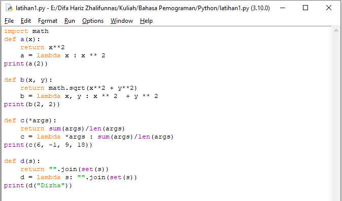

### Output

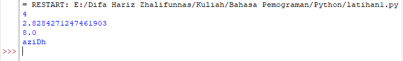

## Tugas Praktikum
> Buat program sederhana dengan mengaplikasikan penggunaan fungsi yang akan menampilkan daftar nilai mahasiswa, dengan ketentuan:
> - Fungsi *tambah()* untuk menambah data
> - Fungsi *tampilkan()* untuk menampilkan data
> - Fungsi *hapus(nama)* untuk menghapus data berdasarkan nama
> - Fungsi *ubah(nama)* untuk mengubah data berdasarkan nama
> - Buatlah flowchart dan penjelasan programnya pada README.md

### Penjelasan
- Buatlah dictionary yang akan diinput dengan data
```
data = {}
```

- Membuat perulangan dan keterangan untuk pilihan menu
```
while True:
    c = input("\n(L)ihat, (T)ambah, (U)bah), (H)apus, (C)ari, (K)eluar: ")
```

- Menambahkan data yang akan diinput kemudian masuk ke dalam dictionary


Output Menambahkan Data

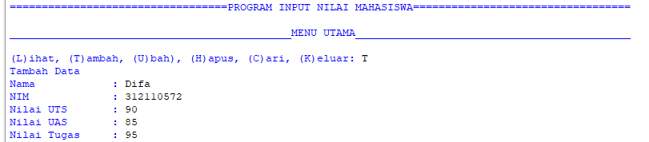

- Jika ingin menampilkan data dapat menggunakan

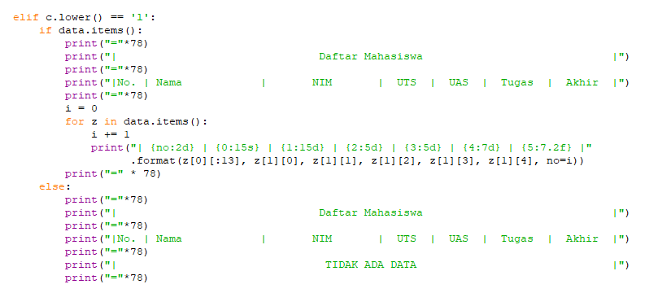

Output menampilkan data

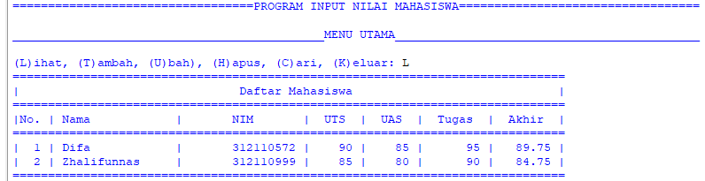

- Mengubah data dapat menggunakan

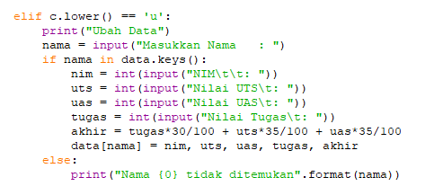

Output mengubah data

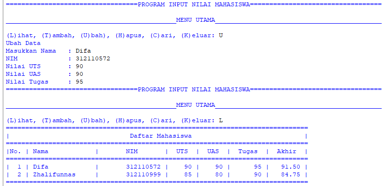

- Menghapus data dapat menggunakan

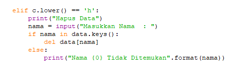

Output menghapus data

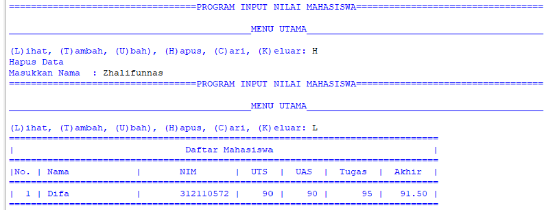

- Mencari data dapat menggunakan

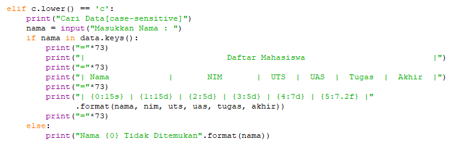

Output mencari data

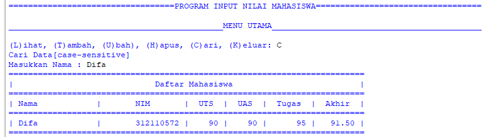

- Jika sudah selesai input pilih menu 'K' untuk memberhentikan program
```
elif c. lower() == 'k':
        break
```

#### Flowchart

 